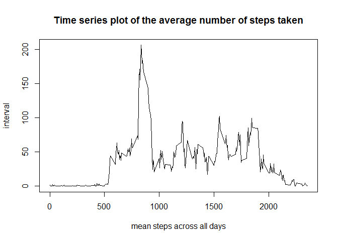

# Reproducible Research: Peer Assessment 1


#-Analysis of steps per day-        

====================================================================
    
        
### Loading and preprocessing the data


*reading  data

```r
raw_data<-read.csv("activity.csv",sep=",")
```

*generating processed data

```r
library(lubridate)
```

```
## 
## Attaching package: 'lubridate'
```

```
## The following object is masked from 'package:base':
## 
##     date
```

```r
library(dplyr)
```

```
## 
## Attaching package: 'dplyr'
```

```
## The following objects are masked from 'package:lubridate':
## 
##     intersect, setdiff, union
```

```
## The following objects are masked from 'package:stats':
## 
##     filter, lag
```

```
## The following objects are masked from 'package:base':
## 
##     intersect, setdiff, setequal, union
```

```r
processed_data<-raw_data
processed_data$date<-ymd(processed_data$date)
```

## What is mean total number of steps taken per day?


```r
library(ggplot2)

data<-group_by(processed_data,date)

step_per_day<-summarize(data,steps_per_day=as.numeric(sum(steps,na.rm=TRUE)))

g<-ggplot(data=step_per_day,aes(steps_per_day))
g+geom_histogram(binwidth = 2500,color="darkblue")+ggtitle("Histogram of the total number of steps taken each day")
```

<!-- -->
        

### Mean and median number of steps taken each day

```r
mean_step_per_day<-mean(step_per_day$steps_per_day)
median_step_per_day<-median(step_per_day$steps_per_day)
```


**Mean: 9354.2295082**  
**Median: 1.0395\times 10^{4}**


## What is the average daily activity pattern?


```r
data<-group_by(processed_data,interval)
time_series<-summarize(data,mean_steps=as.numeric(mean(steps,na.rm=TRUE)))
plot(time_series$interval,time_series$mean_steps,type="l",xlab="mean steps across all days",ylab="interval", main="Time series plot of the average number of steps taken") 
```

<!-- -->

##Which 5-minute interval,  on average, contains the maximum number of steps?


```r
interval<-time_series[time_series$mean_steps %in% max(time_series$mean_steps),]
```

### In **interval 835** are the most **steps: 206.1698113**  


## Imputing missing values


```r
sumNAs<-sum(is.na(processed_data[,1])==TRUE)
```

### Total number of missing values: **2304**

###- **Strategy:** Replace NAs with mean steps of the particular interval  


*Code to describe and show a strategy for imputing missing data*

```r
cleaned_data<-group_by(processed_data,interval)
mean_steps_perinterval<-summarize(cleaned_data,mean_steps=as.numeric(mean(steps,na.rm=TRUE))) 
for (i in 1:nrow(cleaned_data))

        {
        
if(is.na(cleaned_data[i,1]) ==TRUE)
        
        
{interval<-cleaned_data[i,3]

cleaned_data[i,1]<-mean_steps_perinterval[mean_steps_perinterval$interval %in% interval,2]
} 
}
```


*create histogramm*


```r
cleaned_data<-group_by(cleaned_data,date)
step_per_day_cleaned<-summarize(cleaned_data,steps_per_day=as.numeric(sum(steps,na.rm=TRUE)))


g<-ggplot(step_per_day_cleaned,aes(steps_per_day))
g+geom_histogram(binwidth = 2500,color="darkblue")+ggtitle("Histogram of the total number of steps taken each day after missing values are imputed")
```

<!-- -->


### Mean and median number of steps taken each day after imputing 

```r
mean_step_per_day_i<-mean(step_per_day_cleaned$steps_per_day)
median_step_per_day_i<-median(step_per_day_cleaned$steps_per_day)
```

**Mean of raw data: 9354.2295082**  
**Median of raw data: 1.0395\times 10^{4}**


**Mean after imputing: 1.0766189\times 10^{4}**  
**Median after imputing: 1.0766189\times 10^{4}**


## Are there differences in activity patterns between weekdays and weekends?


```r
cleaned_data2<-cleaned_data

cleaned_data2$weekday<-weekdays(as.Date(cleaned_data2$date))


week_day<-cleaned_data2[cleaned_data2$weekday %in% c("Sonntag", "Samstag"),]
week_end<-cleaned_data2[!cleaned_data2$weekday %in% c("Sonntag", "Samstag"),]


week_day<-group_by(week_day,interval)
week_day_mean<-summarize(week_day,mean_steps=as.numeric(mean(steps,na.rm=TRUE)))


week_end<-group_by(week_end,interval)
week_end_mean<-summarize(week_end,mean_steps=as.numeric(mean(steps,na.rm=TRUE)))

par(mfrow=c(2,1), mar=c(5,4,2,1))

plot(week_day_mean$interval,week_day_mean$mean_steps,type="l", xlab = "5 min interval", ylab = "mean steps weekdays",main ="Mean steps taken per 5-minute interval across weekdays and weekends") 
plot(week_end_mean$interval,week_end_mean$mean_steps,type="l",xlab = "5 min interval", ylab = "mean steps weekends") 
```

<!-- -->


